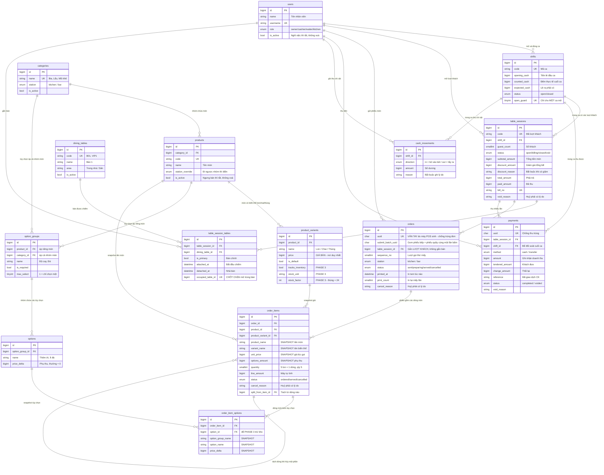

# THIẾT KẾ CƠ SỞ DỮ LIỆU — HỆ THỐNG POS QUÁN NHẬU

> **MÔI TRƯỜNG — ĐỌC TRƯỚC KHI DỰNG DATABASE**
>
> Thiết kế này chạy trên **MariaDB 10.4.32** đi kèm **XAMPP 8.2.12**, cổng 3306. Không cần cài thêm database nào.
>
> **Một thay đổi so với bản gốc:** bảng mã đổi từ `utf8mb4_0900_ai_ci` (chỉ MySQL 8 có) sang **`utf8mb4_unicode_ci`**. Hành vi so sánh tiếng Việt giống nhau — không phân biệt hoa thường, không phân biệt dấu. Cấu trúc bảng, khoá, ràng buộc **giữ nguyên 100%**.
>
> **ĐÃ KIỂM CHỨNG TRÊN MARIADB 10.4.32 — cả 4 phép thử ĐẠT.** Chi tiết ở phụ lục cuối tài liệu. Chốt `uq_tst_one_session_per_table`, chốt `uq_shifts_only_one_open` và toàn bộ ràng buộc `CHECK` đều chặn đúng như trên MySQL 8.
>
> **Một khác biệt về cách báo lỗi, xem bất biến M5:** khi ai đó cố nhập tay đè lên cột máy tự tính, MySQL 8 từ chối cả câu lệnh, còn MariaDB nhận câu lệnh nhưng **vứt bỏ giá trị gian lận** rồi tự tính lại đúng, chỉ kèm cảnh báo `#1906`. Dữ liệu được bảo vệ như nhau, nhưng lập trình viên không nghe thấy tiếng hét — nên phải bù bằng hai luật ở `CLAUDE.md` mục 4 và mục 7.
>
> **Khi đưa vào chạy thật ở quán:** XAMPP tự tuyên bố chỉ dành cho phát triển, và MariaDB 10.4 đã hết hạn hỗ trợ. Máy chạy thật ở quán nên dùng MySQL 8 hoặc MariaDB bản LTS còn hỗ trợ. Đây là việc của Phase 4, ghi lại để không quên.

---

## PHẦN 0 — ĐỌC TRƯỚC: HAI Ý TƯỞNG CHI PHỐI TOÀN BỘ THIẾT KẾ

### Ý tưởng 1 — "Lượt khách" mới là thứ đáng ghi, không phải "cái bàn"

7h tối, một nhóm khách ngồi bàn 3. Họ gọi bia, lát sau gọi thêm mồi, kéo thêm bạn nên ghép bàn 4.
10h họ trả tiền và về. 10h15 nhóm khác vào ngồi đúng bàn 3 đó.

Cái tồn tại từ 7h đến 10h **không phải "bàn 3"** — bàn 3 là cái bàn gỗ, nó nằm đó mãi mãi.
Cái tồn tại là **lượt khách**.

Vì vậy mọi thứ — gọi món, giảm giá, thu tiền, in bill — đều gắn vào **lượt khách** (`table_sessions`),
không gắn vào cái bàn gỗ (`dining_tables`). Điều này cũng giải quyết luôn chuyện ghép bàn:
một lượt khách chiếm được nhiều bàn cùng lúc.

### Ý tưởng 2 — Sổ sách chỉ ghi thêm, không tẩy xóa

Quán không có cục tẩy. Khách trả món, bếp làm hỏng, phục vụ bấm nhầm — tất cả đều được
**đánh dấu là đã hủy**, kèm lý do, ai hủy, lúc mấy giờ. Không dòng nào biến mất.

Lợi ích thực tế: cuối tháng anh mở ra xem được *"tháng này hủy 47 món, trong đó 31 món do bấm nhầm,
đều rơi vào ca của cùng một người"*. Nếu xóa cứng, con số đó không bao giờ tồn tại.

---

## PHẦN 1 — DANH SÁCH BẢNG VÀ VAI TRÒ

Tổng cộng **15 bảng**, chia 5 nhóm.

### Nhóm A — Con người và ca làm việc

| # | Bảng | Vai trò bằng ngôn ngữ quán |
|---|---|---|
| 1 | `users` | **Sổ nhân viên.** Chủ quán, thu ngân, phục vụ, bếp. Mọi thao tác quan trọng đều truy được ra người làm. |
| 2 | `shifts` | **Ca làm việc.** Mở ca lúc mấy giờ, trong két có sẵn bao nhiêu tiền lẻ, cuối ca đếm được bao nhiêu, lệch bao nhiêu, ai chịu trách nhiệm. |
| 3 | `cash_movements` | **Sổ thu chi vặt trong ca.** "Chi 200k mua đá", "chủ rút 1 triệu", "khách bồi thường ly vỡ 50k". Không có sổ này thì cuối ca lúc nào cũng lệch quỹ mà không ai giải thích được vì sao. |

### Nhóm B — Không gian quán

| # | Bảng | Vai trò bằng ngôn ngữ quán |
|---|---|---|
| 4 | `dining_tables` | **Sơ đồ bàn.** Bàn 1, Bàn 2, Bàn VIP, Bàn sân... Danh sách này gần như không đổi. |
| 5 | `table_sessions` | **Lượt khách — trái tim hệ thống.** Một nhóm khách từ lúc ngồi xuống đến lúc đứng dậy. Mở lúc nào, mấy người, tổng tiền, đã thu chưa, số bill là bao nhiêu. |
| 6 | `table_session_tables` | **Bảng "ai đang ngồi bàn nào".** Ghi lượt khách này đang chiếm những bàn nào, chiếm từ lúc nào, nhả ra lúc nào. Đây là chỗ cho phép **ghép 2–3 bàn**, và cũng là chốt chặn **hai nhân viên mở trùng một bàn**. |

### Nhóm C — Thực đơn

| # | Bảng | Vai trò bằng ngôn ngữ quán |
|---|---|---|
| 7 | `categories` | **Nhóm món trong thực đơn.** Bia, Mồi khô, Lẩu, Nước ngọt. Mỗi nhóm khai báo sẵn **in tem ở đâu**: bếp hay quầy pha chế. |
| 8 | `products` | **Món.** "Bia Tiger", "Gà nướng muối ớt". Món **không mang giá** — giá nằm ở biến thể. |
| 9 | `product_variants` | **Biến thể có giá.** Tiger — lon 25.000 / chai 27.000 / thùng 550.000. Món nào không có biến thể (ví dụ Gà nướng) thì vẫn có **đúng một** biến thể mặc định để mang giá. Đây là nơi duy nhất chứa giá bán. |
| 10 | `option_groups` | **Nhóm tùy chọn.** "Độ cay", "Đá", "Rau ăn kèm". Mỗi nhóm khai báo: bắt buộc chọn hay không, chọn được một hay nhiều. Nhóm gắn cho **một món cụ thể** hoặc **cả một nhóm món** (ví dụ "Đá" áp cho toàn bộ nhóm Nước ngọt). |
| 11 | `options` | **Tùy chọn cụ thể.** "Thêm ớt +0đ", "Ít đá +0đ", "Không rau +0đ", "Thêm mì +10.000đ". |

### Nhóm D — Giao dịch bán hàng

| # | Bảng | Vai trò bằng ngôn ngữ quán |
|---|---|---|
| 12 | `orders` | **Một phiếu gọi món = một tờ tem.** Phục vụ bấm "Gửi" một lần: món ăn gom thành một phiếu xuống **bếp**, đồ uống gom thành một phiếu ra **quầy**. Cùng một lượt khách sẽ có nhiều phiếu (lượt 1, lượt 2, lượt 3...). |
| 13 | `order_items` | **Từng dòng món trên phiếu**, kèm **bản sao tên và giá tại đúng thời điểm gọi**. 5 lon Tiger giống nhau = 1 dòng, số lượng 5. |
| 14 | `order_item_options` | **Các tùy chọn đã chọn cho từng dòng món**, cũng lưu bản sao tên và tiền cộng thêm. |

### Nhóm E — Tiền khách trả

| # | Bảng | Vai trò bằng ngôn ngữ quán |
|---|---|---|
| 15 | `payments` | **Từng lần thu tiền của một lượt khách.** Cho phép thu nhiều lần: khách đưa 500k tiền mặt, phần còn lại chuyển khoản. Ghi rõ khách đưa bao nhiêu, thối lại bao nhiêu, mã giao dịch chuyển khoản là gì. |

### Vì sao 15 bảng, vượt mục tiêu 12?

Ba bảng vượt mục tiêu là `table_session_tables`, `option_groups`, `cash_movements`.

- **`table_session_tables` — không thể bỏ.** Bỏ nó thì không ghép bàn được (một lượt khách chỉ ngồi được một bàn), và mất luôn cơ chế chống mở trùng bàn ở tầng dữ liệu.
- **`option_groups` — nên giữ.** Có thể gộp luật "bắt buộc chọn / chọn mấy cái" vào thẳng từng tùy chọn, nhưng khi đó máy không tự chặn được lỗi *"khách chọn cả **ít đá** lẫn **nhiều đá**"* — nhân viên phải tự nhớ.
- **`cash_movements` — anh đã duyệt.** Đây là cái quyết định việc đối soát cuối ca có ý nghĩa hay chỉ là hình thức.

### Những bảng tôi CỐ TÌNH KHÔNG tạo

| Bảng thường thấy ở POS khác | Vì sao ở đây không cần |
|---|---|
| Bảng "tem bếp" riêng | Mỗi `orders` **chính là** một tem. Thêm bảng nữa chỉ chép lại dữ liệu và tạo nguy cơ hai nơi nói khác nhau. |
| Bảng "hóa đơn / bill" riêng | Bill chính là bản in tổng của một lượt khách. Số bill, giờ in, người in để thẳng trên `table_sessions`. |
| Bảng "phương thức thanh toán" | Chỉ có tiền mặt và chuyển khoản. Một cột trạng thái là đủ; tạo bảng cho 2 dòng dữ liệu là thừa. |
| Bảng "trạng thái bàn" | Bàn trống hay có khách suy ra được từ `table_session_tables`. Lưu riêng sẽ có ngày hai nơi mâu thuẫn. |

---

## PHẦN 2 — CHỖ CHỪA SẴN CHO PHASE 3 (TRỪ KHO THEO ĐỊNH LƯỢNG)

Chưa tạo bảng nguyên liệu nào. Nhưng ba thứ đã được chuẩn bị sẵn để sau này gắn vào mà **không phải đập đi làm lại**:

1. **Dòng món lưu đúng biến thể đã bán** (`order_items.product_variant_id`). Sau này mới nổ được "bán 1 thùng = trừ kho 24 lon".
2. **`product_variants` có sẵn hai ô**: `stock_unit` (đơn vị tính kho: lon, chai, gam, ml) và `stock_factor` (một đơn vị bán bằng bao nhiêu đơn vị kho — thùng = 24), cùng cờ `tracks_inventory` (món này có trừ kho không).
3. **Tùy chọn cũng lưu lại `option_id`**, để sau này "thêm ớt" trừ được kho ớt.

Khi làm Phase 3, chỉ cần thêm các bảng mới (`ingredients`, `recipes`, `stock_entries`) và **không sửa** bảng nào ở trên.

---

## PHẦN 3 — DDL ĐẦY ĐỦ

```sql
SET NAMES utf8mb4 COLLATE utf8mb4_unicode_ci;
SET FOREIGN_KEY_CHECKS = 1;

-- =====================================================================
-- NHÓM A — CON NGƯỜI VÀ CA LÀM VIỆC
-- =====================================================================

-- 1. NHÂN VIÊN
CREATE TABLE users (
    id                  BIGINT UNSIGNED NOT NULL AUTO_INCREMENT,
    name                VARCHAR(100)    NOT NULL COMMENT 'Tên hiển thị trên bill và tem',
    username            VARCHAR(50)     NOT NULL COMMENT 'Tên đăng nhập',
    password            VARCHAR(255)    NOT NULL COMMENT 'Mật khẩu đã mã hoá (bcrypt)',
    pin_code            VARCHAR(255)    NULL     COMMENT 'Mã PIN 4-6 số đã mã hoá, dùng để duyệt nhanh việc hủy món',
    role                ENUM('owner','cashier','waiter','kitchen') NOT NULL DEFAULT 'waiter',
    is_active           TINYINT(1)      NOT NULL DEFAULT 1 COMMENT 'Nghỉ việc thì tắt cờ này, KHÔNG xoá',
    remember_token      VARCHAR(100)    NULL,
    created_at          TIMESTAMP       NULL,
    updated_at          TIMESTAMP       NULL,
    PRIMARY KEY (id),
    UNIQUE KEY uq_users_username (username),
    KEY idx_users_active_role (is_active, role)
) ENGINE=InnoDB DEFAULT CHARSET=utf8mb4 COLLATE=utf8mb4_unicode_ci;

-- 2. CA LÀM VIỆC
CREATE TABLE shifts (
    id                  BIGINT UNSIGNED NOT NULL AUTO_INCREMENT,
    code                VARCHAR(30)     NOT NULL COMMENT 'Mã ca hiển thị, ví dụ CA-20260730-01',

    opened_by_user_id   BIGINT UNSIGNED NOT NULL,
    opened_at           DATETIME        NOT NULL,
    opening_cash        BIGINT UNSIGNED NOT NULL DEFAULT 0 COMMENT 'Tiền lẻ có sẵn trong két khi mở ca (đồng)',

    closed_by_user_id   BIGINT UNSIGNED NULL,
    closed_at           DATETIME        NULL,
    counted_cash        BIGINT UNSIGNED NULL COMMENT 'Số tiền mặt ĐẾM THỰC TẾ trong két cuối ca (đồng)',
    expected_cash       BIGINT UNSIGNED NULL COMMENT 'Số tiền mặt LẼ RA phải có, do hệ thống tính, chốt lại lúc đóng ca',

    status              ENUM('open','closed') NOT NULL DEFAULT 'open',
    note                VARCHAR(500)    NULL COMMENT 'Ghi chú đối soát: vì sao lệch',

    -- Cột kỹ thuật: chỉ có giá trị 1 khi ca đang mở => khoá duy nhất bên dưới
    -- bảo đảm KHÔNG BAO GIỜ có hai ca mở cùng lúc.
    open_guard          TINYINT UNSIGNED
                        GENERATED ALWAYS AS (IF(status = 'open', 1, NULL)) STORED,

    created_at          TIMESTAMP       NULL,
    updated_at          TIMESTAMP       NULL,
    PRIMARY KEY (id),
    UNIQUE KEY uq_shifts_code (code),
    UNIQUE KEY uq_shifts_only_one_open (open_guard),
    KEY idx_shifts_opened_at (opened_at),
    CONSTRAINT fk_shifts_opened_by FOREIGN KEY (opened_by_user_id) REFERENCES users (id) ON DELETE RESTRICT,
    CONSTRAINT fk_shifts_closed_by FOREIGN KEY (closed_by_user_id) REFERENCES users (id) ON DELETE RESTRICT,
    CONSTRAINT ck_shifts_closed_fields CHECK (
        (status = 'open'   AND closed_at IS NULL     AND counted_cash IS NULL)
     OR (status = 'closed' AND closed_at IS NOT NULL AND counted_cash IS NOT NULL
                           AND closed_by_user_id IS NOT NULL AND expected_cash IS NOT NULL)
    )
) ENGINE=InnoDB DEFAULT CHARSET=utf8mb4 COLLATE=utf8mb4_unicode_ci;

-- 3. THU CHI TIỀN MẶT NGOÀI BÁN HÀNG
CREATE TABLE cash_movements (
    id                  BIGINT UNSIGNED NOT NULL AUTO_INCREMENT,
    shift_id            BIGINT UNSIGNED NOT NULL,
    direction           ENUM('in','out') NOT NULL COMMENT 'in = bỏ thêm tiền vào két, out = lấy tiền ra',
    amount              BIGINT UNSIGNED NOT NULL COMMENT 'Luôn là số dương (đồng); chiều tiền nằm ở cột direction',
    reason              VARCHAR(255)    NOT NULL COMMENT 'Bắt buộc ghi lý do: "mua đá", "chủ rút tiền"',
    created_by_user_id  BIGINT UNSIGNED NOT NULL,
    occurred_at         DATETIME        NOT NULL,
    created_at          TIMESTAMP       NULL,
    updated_at          TIMESTAMP       NULL,
    PRIMARY KEY (id),
    KEY idx_cash_movements_shift (shift_id, occurred_at),
    CONSTRAINT fk_cash_movements_shift   FOREIGN KEY (shift_id)           REFERENCES shifts (id) ON DELETE RESTRICT,
    CONSTRAINT fk_cash_movements_user    FOREIGN KEY (created_by_user_id) REFERENCES users (id)  ON DELETE RESTRICT,
    CONSTRAINT ck_cash_movements_amount  CHECK (amount > 0)
) ENGINE=InnoDB DEFAULT CHARSET=utf8mb4 COLLATE=utf8mb4_unicode_ci;

-- =====================================================================
-- NHÓM B — KHÔNG GIAN QUÁN
-- =====================================================================

-- 4. BÀN VẬT LÝ
CREATE TABLE dining_tables (
    id                  BIGINT UNSIGNED NOT NULL AUTO_INCREMENT,
    code                VARCHAR(20)     NOT NULL COMMENT 'Mã bàn ngắn in trên tem: B01, VIP1',
    name                VARCHAR(50)     NOT NULL COMMENT 'Tên hiển thị: Bàn 1, Bàn sân',
    area                VARCHAR(50)     NULL     COMMENT 'Khu vực: Trong nhà, Sân, Lầu 1',
    seats               TINYINT UNSIGNED NOT NULL DEFAULT 4 COMMENT 'Số ghế, chỉ để gợi ý xếp bàn',
    sort_order          SMALLINT UNSIGNED NOT NULL DEFAULT 0,
    is_active           TINYINT(1)      NOT NULL DEFAULT 1 COMMENT 'Bàn dẹp đi thì tắt cờ, KHÔNG xoá',
    created_at          TIMESTAMP       NULL,
    updated_at          TIMESTAMP       NULL,
    PRIMARY KEY (id),
    UNIQUE KEY uq_dining_tables_code (code),
    KEY idx_dining_tables_layout (is_active, area, sort_order)
) ENGINE=InnoDB DEFAULT CHARSET=utf8mb4 COLLATE=utf8mb4_unicode_ci;

-- 5. LƯỢT KHÁCH  (TRÁI TIM HỆ THỐNG)
CREATE TABLE table_sessions (
    id                  BIGINT UNSIGNED NOT NULL AUTO_INCREMENT,
    code                VARCHAR(30)     NOT NULL COMMENT 'Mã lượt khách: PH-20260730-0007',
    shift_id            BIGINT UNSIGNED NOT NULL COMMENT 'Lượt khách này mở trong ca nào',

    guest_count         SMALLINT UNSIGNED NOT NULL DEFAULT 1 COMMENT 'Số khách, dùng để thống kê chi tiêu bình quân',
    status              ENUM('open','billing','closed','void') NOT NULL DEFAULT 'open'
                        COMMENT 'open=đang nhậu, billing=đã in tạm tính đang chờ trả, closed=đã thu đủ, void=huỷ toàn bộ',

    opened_by_user_id   BIGINT UNSIGNED NOT NULL,
    opened_at           DATETIME        NOT NULL,

    -- Tiền: chốt lại tại thời điểm tính tiền, KHÔNG tính lại về sau
    subtotal_amount     BIGINT UNSIGNED NOT NULL DEFAULT 0 COMMENT 'Tổng tiền món chưa giảm giá (đồng)',
    discount_amount     BIGINT UNSIGNED NOT NULL DEFAULT 0 COMMENT 'Số tiền giảm trên tổng bill (đồng)',
    discount_reason     VARCHAR(255)    NULL COMMENT 'Bắt buộc ghi khi có giảm giá: "khách quen", "bớt lẻ"',
    total_amount        BIGINT UNSIGNED NOT NULL DEFAULT 0 COMMENT 'Số tiền khách phải trả = subtotal - discount',
    paid_amount         BIGINT UNSIGNED NOT NULL DEFAULT 0 COMMENT 'Đã thu được bao nhiêu (cộng dồn từ payments)',

    -- In ấn
    bill_no             VARCHAR(30)     NULL COMMENT 'Số hoá đơn, chỉ sinh khi in bill chính thức',
    bill_printed_at     DATETIME        NULL,
    provisional_printed_at DATETIME     NULL COMMENT 'Lần cuối in tạm tính',
    provisional_print_count SMALLINT UNSIGNED NOT NULL DEFAULT 0,

    closed_by_user_id   BIGINT UNSIGNED NULL,
    closed_at           DATETIME        NULL,

    -- Huỷ toàn bộ lượt khách (khách bỏ về, mở nhầm)
    voided_by_user_id   BIGINT UNSIGNED NULL,
    voided_at           DATETIME        NULL,
    void_reason         VARCHAR(255)    NULL,

    note                VARCHAR(500)    NULL,
    created_at          TIMESTAMP       NULL,
    updated_at          TIMESTAMP       NULL,
    PRIMARY KEY (id),
    UNIQUE KEY uq_table_sessions_code (code),
    UNIQUE KEY uq_table_sessions_bill_no (bill_no),
    KEY idx_table_sessions_status_opened (status, opened_at),
    KEY idx_table_sessions_shift (shift_id, status),
    KEY idx_table_sessions_closed_at (closed_at),
    CONSTRAINT fk_table_sessions_shift     FOREIGN KEY (shift_id)          REFERENCES shifts (id) ON DELETE RESTRICT,
    CONSTRAINT fk_table_sessions_opened_by FOREIGN KEY (opened_by_user_id) REFERENCES users (id)  ON DELETE RESTRICT,
    CONSTRAINT fk_table_sessions_closed_by FOREIGN KEY (closed_by_user_id) REFERENCES users (id)  ON DELETE RESTRICT,
    CONSTRAINT fk_table_sessions_voided_by FOREIGN KEY (voided_by_user_id) REFERENCES users (id)  ON DELETE RESTRICT,
    CONSTRAINT ck_table_sessions_discount CHECK (discount_amount <= subtotal_amount),
    -- Viết dạng cộng thay vì trừ: số tiền là kiểu KHÔNG ÂM, phép trừ ra số âm sẽ
    -- gây lỗi kiểu dữ liệu khó hiểu thay vì báo đúng ràng buộc bị vi phạm.
    CONSTRAINT ck_table_sessions_total    CHECK (total_amount + discount_amount = subtotal_amount),
    CONSTRAINT ck_table_sessions_discount_reason CHECK (discount_amount = 0 OR discount_reason IS NOT NULL),
    CONSTRAINT ck_table_sessions_void     CHECK (status <> 'void' OR (voided_at IS NOT NULL AND void_reason IS NOT NULL)),
    CONSTRAINT ck_table_sessions_closed   CHECK (status <> 'closed' OR (closed_at IS NOT NULL AND paid_amount >= total_amount))
) ENGINE=InnoDB DEFAULT CHARSET=utf8mb4 COLLATE=utf8mb4_unicode_ci;

-- 6. LƯỢT KHÁCH ĐANG CHIẾM BÀN NÀO  (GHÉP BÀN + CHỐNG MỞ TRÙNG)
CREATE TABLE table_session_tables (
    id                  BIGINT UNSIGNED NOT NULL AUTO_INCREMENT,
    table_session_id    BIGINT UNSIGNED NOT NULL,
    dining_table_id     BIGINT UNSIGNED NOT NULL,
    is_primary          TINYINT(1)      NOT NULL DEFAULT 0 COMMENT 'Bàn chính, dùng để gọi tên lượt khách trên màn hình',
    attached_at         DATETIME        NOT NULL COMMENT 'Bắt đầu chiếm bàn này',
    detached_at         DATETIME        NULL     COMMENT 'Nhả bàn ra lúc nào; NULL = đang còn chiếm',
    attached_by_user_id BIGINT UNSIGNED NOT NULL,

    -- CHỐT CHẶN QUAN TRỌNG NHẤT CỦA HỆ THỐNG:
    -- cột này chỉ có giá trị khi bàn đang bị chiếm (detached_at IS NULL).
    -- Khoá duy nhất bên dưới khiến MySQL TỰ TỪ CHỐI người thứ hai mở cùng một bàn,
    -- kể cả khi hai người bấm trong cùng một phần nghìn giây.
    occupied_table_id   BIGINT UNSIGNED
                        GENERATED ALWAYS AS (IF(detached_at IS NULL, dining_table_id, NULL)) STORED,

    created_at          TIMESTAMP       NULL,
    updated_at          TIMESTAMP       NULL,
    PRIMARY KEY (id),
    UNIQUE KEY uq_tst_one_session_per_table (occupied_table_id),
    KEY idx_tst_session (table_session_id, detached_at),
    KEY idx_tst_table_history (dining_table_id, attached_at),
    CONSTRAINT fk_tst_session FOREIGN KEY (table_session_id)   REFERENCES table_sessions (id) ON DELETE RESTRICT,
    CONSTRAINT fk_tst_table   FOREIGN KEY (dining_table_id)    REFERENCES dining_tables (id)  ON DELETE RESTRICT,
    CONSTRAINT fk_tst_user    FOREIGN KEY (attached_by_user_id) REFERENCES users (id)         ON DELETE RESTRICT,
    CONSTRAINT ck_tst_time    CHECK (detached_at IS NULL OR detached_at >= attached_at)
) ENGINE=InnoDB DEFAULT CHARSET=utf8mb4 COLLATE=utf8mb4_unicode_ci;

-- =====================================================================
-- NHÓM C — THỰC ĐƠN
-- =====================================================================

-- 7. NHÓM MÓN
CREATE TABLE categories (
    id                  BIGINT UNSIGNED NOT NULL AUTO_INCREMENT,
    name                VARCHAR(100)    NOT NULL COMMENT 'Bia, Mồi khô, Lẩu, Nước ngọt',
    station             ENUM('kitchen','bar') NOT NULL DEFAULT 'kitchen'
                        COMMENT 'Món thuộc nhóm này in tem ở đâu: kitchen=bếp, bar=quầy pha chế',
    sort_order          SMALLINT UNSIGNED NOT NULL DEFAULT 0,
    is_active           TINYINT(1)      NOT NULL DEFAULT 1,
    created_at          TIMESTAMP       NULL,
    updated_at          TIMESTAMP       NULL,
    PRIMARY KEY (id),
    UNIQUE KEY uq_categories_name (name),
    KEY idx_categories_menu (is_active, sort_order)
) ENGINE=InnoDB DEFAULT CHARSET=utf8mb4 COLLATE=utf8mb4_unicode_ci;

-- 8. MÓN
CREATE TABLE products (
    id                  BIGINT UNSIGNED NOT NULL AUTO_INCREMENT,
    category_id         BIGINT UNSIGNED NOT NULL,
    code                VARCHAR(30)     NOT NULL COMMENT 'Mã món để gõ nhanh: TIGER, GANUONG',
    name                VARCHAR(150)    NOT NULL COMMENT 'Tên món in trên tem và bill',
    description         VARCHAR(500)    NULL,
    station_override    ENUM('kitchen','bar') NULL
                        COMMENT 'Bỏ trống = theo nhóm món. Chỉ điền khi món đi ngược nhóm, ví dụ Trà đá nằm nhóm Mồi nhưng do quầy làm',
    is_active           TINYINT(1)      NOT NULL DEFAULT 1 COMMENT 'Ngưng bán thì tắt cờ, KHÔNG xoá',
    sort_order          SMALLINT UNSIGNED NOT NULL DEFAULT 0,
    image_path          VARCHAR(255)    NULL,
    created_at          TIMESTAMP       NULL,
    updated_at          TIMESTAMP       NULL,
    PRIMARY KEY (id),
    UNIQUE KEY uq_products_code (code),
    KEY idx_products_menu (is_active, category_id, sort_order),
    KEY idx_products_name (name),
    CONSTRAINT fk_products_category FOREIGN KEY (category_id) REFERENCES categories (id) ON DELETE RESTRICT
) ENGINE=InnoDB DEFAULT CHARSET=utf8mb4 COLLATE=utf8mb4_unicode_ci;

-- 9. BIẾN THỂ CỦA MÓN — NƠI DUY NHẤT CHỨA GIÁ BÁN
CREATE TABLE product_variants (
    id                  BIGINT UNSIGNED NOT NULL AUTO_INCREMENT,
    product_id          BIGINT UNSIGNED NOT NULL,
    name                VARCHAR(100)    NOT NULL COMMENT 'Lon, Chai, Thùng, Phần nhỏ, Phần lớn. Món không có biến thể ghi "Mặc định"',
    price               BIGINT UNSIGNED NOT NULL COMMENT 'Giá bán hiện hành (đồng). Sửa giá KHÔNG ảnh hưởng hoá đơn cũ',
    is_default          TINYINT(1)      NOT NULL DEFAULT 0 COMMENT 'Biến thể chọn sẵn khi bấm vào món',
    is_active           TINYINT(1)      NOT NULL DEFAULT 1,
    sort_order          SMALLINT UNSIGNED NOT NULL DEFAULT 0,

    -- Ba cột chừa sẵn cho Phase 3, hiện chưa dùng
    tracks_inventory    TINYINT(1)      NOT NULL DEFAULT 0 COMMENT 'PHASE 3: món này có trừ kho không',
    stock_unit          VARCHAR(20)     NULL     COMMENT 'PHASE 3: đơn vị kho — lon, chai, gam, ml',
    stock_factor        INT UNSIGNED    NOT NULL DEFAULT 1 COMMENT 'PHASE 3: bán 1 đơn vị này trừ bao nhiêu đơn vị kho. Thùng bia = 24',

    created_at          TIMESTAMP       NULL,
    updated_at          TIMESTAMP       NULL,
    PRIMARY KEY (id),
    UNIQUE KEY uq_variants_product_name (product_id, name),
    KEY idx_variants_active (product_id, is_active, sort_order),
    CONSTRAINT fk_variants_product FOREIGN KEY (product_id) REFERENCES products (id) ON DELETE RESTRICT,
    CONSTRAINT ck_variants_factor  CHECK (stock_factor >= 1)
) ENGINE=InnoDB DEFAULT CHARSET=utf8mb4 COLLATE=utf8mb4_unicode_ci;

-- 10. NHÓM TÙY CHỌN
CREATE TABLE option_groups (
    id                  BIGINT UNSIGNED NOT NULL AUTO_INCREMENT,
    name                VARCHAR(100)    NOT NULL COMMENT 'Độ cay, Đá, Rau ăn kèm',

    -- Gắn cho MỘT món cụ thể, HOẶC cho cả một nhóm món. Đúng một trong hai.
    product_id          BIGINT UNSIGNED NULL COMMENT 'Áp cho riêng món này',
    category_id         BIGINT UNSIGNED NULL COMMENT 'Áp cho mọi món trong nhóm này',

    is_required         TINYINT(1)      NOT NULL DEFAULT 0 COMMENT 'Bắt buộc khách phải chọn mới gửi bếp được',
    min_select          TINYINT UNSIGNED NOT NULL DEFAULT 0,
    max_select          TINYINT UNSIGNED NOT NULL DEFAULT 1 COMMENT '1 = chỉ chọn một (ít đá HOẶC nhiều đá). Lớn hơn = chọn nhiều',
    sort_order          SMALLINT UNSIGNED NOT NULL DEFAULT 0,
    is_active           TINYINT(1)      NOT NULL DEFAULT 1,
    created_at          TIMESTAMP       NULL,
    updated_at          TIMESTAMP       NULL,
    PRIMARY KEY (id),
    KEY idx_option_groups_product  (product_id, is_active),
    KEY idx_option_groups_category (category_id, is_active),
    CONSTRAINT fk_option_groups_product  FOREIGN KEY (product_id)  REFERENCES products (id)   ON DELETE RESTRICT,
    CONSTRAINT fk_option_groups_category FOREIGN KEY (category_id) REFERENCES categories (id) ON DELETE RESTRICT,
    CONSTRAINT ck_option_groups_scope CHECK (
        (product_id IS NOT NULL AND category_id IS NULL)
     OR (product_id IS NULL     AND category_id IS NOT NULL)
    ),
    CONSTRAINT ck_option_groups_select CHECK (
        max_select >= 1 AND min_select <= max_select
        AND (is_required = 0 OR min_select >= 1)
    )
) ENGINE=InnoDB DEFAULT CHARSET=utf8mb4 COLLATE=utf8mb4_unicode_ci;

-- 11. TÙY CHỌN CỤ THỂ
CREATE TABLE options (
    id                  BIGINT UNSIGNED NOT NULL AUTO_INCREMENT,
    option_group_id     BIGINT UNSIGNED NOT NULL,
    name                VARCHAR(100)    NOT NULL COMMENT 'Thêm ớt, Ít đá, Không rau, Thêm mì',
    price_delta         BIGINT UNSIGNED NOT NULL DEFAULT 0 COMMENT 'Tiền cộng thêm cho MỘT đơn vị món (đồng). Phần lớn là 0',
    is_default          TINYINT(1)      NOT NULL DEFAULT 0,
    sort_order          SMALLINT UNSIGNED NOT NULL DEFAULT 0,
    is_active           TINYINT(1)      NOT NULL DEFAULT 1,
    created_at          TIMESTAMP       NULL,
    updated_at          TIMESTAMP       NULL,
    PRIMARY KEY (id),
    UNIQUE KEY uq_options_group_name (option_group_id, name),
    KEY idx_options_active (option_group_id, is_active, sort_order),
    CONSTRAINT fk_options_group FOREIGN KEY (option_group_id) REFERENCES option_groups (id) ON DELETE RESTRICT
) ENGINE=InnoDB DEFAULT CHARSET=utf8mb4 COLLATE=utf8mb4_unicode_ci;

-- =====================================================================
-- NHÓM D — GIAO DỊCH BÁN HÀNG
-- =====================================================================

-- 12. PHIẾU GỌI MÓN = MỘT TỜ TEM
CREATE TABLE orders (
    id                  BIGINT UNSIGNED NOT NULL AUTO_INCREMENT,

    -- "Vân tay" do máy POS sinh TRƯỚC KHI gửi lên. Bấm gửi hai lần vì mạng lag
    -- thì lần thứ hai mang cùng mã này và bị từ chối => bếp chỉ nhận đúng một tem.
    uuid                CHAR(36) CHARACTER SET ascii COLLATE ascii_bin NOT NULL,
    -- Một lần bấm "Gửi" có thể sinh 2 phiếu (bếp + quầy). Mã này gom chúng lại.
    submit_batch_uuid   CHAR(36) CHARACTER SET ascii COLLATE ascii_bin NULL,

    table_session_id    BIGINT UNSIGNED NOT NULL COMMENT 'RÀNG BUỘC: gắn vào LƯỢT KHÁCH, không gắn vào bàn',
    sequence_no         SMALLINT UNSIGNED NOT NULL COMMENT 'Lượt gọi thứ mấy của lượt khách này: 1, 2, 3...',
    station             ENUM('kitchen','bar') NOT NULL COMMENT 'Phiếu này in ở bếp hay ở quầy',

    status              ENUM('sent','preparing','served','cancelled') NOT NULL DEFAULT 'sent',

    created_by_user_id  BIGINT UNSIGNED NOT NULL COMMENT 'Phục vụ nào gửi',
    sent_at             DATETIME        NOT NULL,
    printed_at          DATETIME        NULL COMMENT 'Lần cuối in tem thành công',
    print_count         SMALLINT UNSIGNED NOT NULL DEFAULT 0 COMMENT 'In lại mấy lần (máy in kẹt giấy)',
    served_at           DATETIME        NULL,

    cancelled_by_user_id BIGINT UNSIGNED NULL,
    cancelled_at        DATETIME        NULL,
    cancel_reason       VARCHAR(255)    NULL,

    note                VARCHAR(500)    NULL COMMENT 'Ghi chú cho cả phiếu: "làm nhanh giúp", "khách gấp"',
    created_at          TIMESTAMP       NULL,
    updated_at          TIMESTAMP       NULL,
    PRIMARY KEY (id),
    UNIQUE KEY uq_orders_uuid (uuid),
    UNIQUE KEY uq_orders_session_seq_station (table_session_id, sequence_no, station),
    KEY idx_orders_station_board (station, status, sent_at),
    KEY idx_orders_session (table_session_id, sent_at),
    KEY idx_orders_batch (submit_batch_uuid),
    CONSTRAINT fk_orders_session      FOREIGN KEY (table_session_id)     REFERENCES table_sessions (id) ON DELETE RESTRICT,
    CONSTRAINT fk_orders_created_by   FOREIGN KEY (created_by_user_id)   REFERENCES users (id)          ON DELETE RESTRICT,
    CONSTRAINT fk_orders_cancelled_by FOREIGN KEY (cancelled_by_user_id) REFERENCES users (id)          ON DELETE RESTRICT,
    CONSTRAINT ck_orders_cancel CHECK (
        status <> 'cancelled' OR (cancelled_at IS NOT NULL AND cancel_reason IS NOT NULL AND cancelled_by_user_id IS NOT NULL)
    )
) ENGINE=InnoDB DEFAULT CHARSET=utf8mb4 COLLATE=utf8mb4_unicode_ci;

-- 13. DÒNG MÓN TRÊN PHIẾU
CREATE TABLE order_items (
    id                  BIGINT UNSIGNED NOT NULL AUTO_INCREMENT,
    order_id            BIGINT UNSIGNED NOT NULL,

    -- Trỏ về thực đơn: dùng để thống kê và để Phase 3 trừ kho.
    -- KHÔNG dùng để hiển thị tên hay tính tiền.
    product_id          BIGINT UNSIGNED NOT NULL,
    product_variant_id  BIGINT UNSIGNED NOT NULL,

    -- BẢN SAO tại thời điểm gọi món. Đây mới là thứ hiện trên tem và bill.
    product_name        VARCHAR(150)    NOT NULL COMMENT 'Ảnh chụp tên món lúc gọi',
    variant_name        VARCHAR(100)    NOT NULL COMMENT 'Ảnh chụp tên biến thể lúc gọi: Lon, Thùng',
    unit_price          BIGINT UNSIGNED NOT NULL COMMENT 'Ảnh chụp giá một đơn vị lúc gọi (đồng)',
    options_amount      BIGINT UNSIGNED NOT NULL DEFAULT 0 COMMENT 'Tổng tiền tùy chọn cộng thêm cho MỘT đơn vị (đồng)',
    quantity            SMALLINT UNSIGNED NOT NULL COMMENT 'Số lượng. 5 lon Tiger giống nhau = 1 dòng, quantity = 5',

    -- Máy tự tính, không ai nhập tay được => không bao giờ sai phép nhân
    line_amount         BIGINT UNSIGNED
                        GENERATED ALWAYS AS ((unit_price + options_amount) * quantity) STORED
                        COMMENT 'Thành tiền dòng này (đồng)',

    status              ENUM('ordered','served','cancelled') NOT NULL DEFAULT 'ordered',
    served_at           DATETIME        NULL,

    -- Huỷ món: không xoá dòng, chỉ đổi trạng thái
    cancelled_by_user_id BIGINT UNSIGNED NULL,
    cancelled_at        DATETIME        NULL,
    cancel_reason       VARCHAR(255)    NULL COMMENT 'Bấm nhầm, khách trả, bếp làm hỏng, hết hàng',

    -- Huỷ 1 trong 5 lon: hệ thống tách dòng 5 thành dòng 4 + dòng 1, rồi huỷ dòng 1.
    -- Cột này ghi lại dòng gốc để truy vết.
    split_from_item_id  BIGINT UNSIGNED NULL,

    note                VARCHAR(255)    NULL COMMENT 'Ghi chú riêng dòng này: "nướng cháy cạnh"',
    created_at          TIMESTAMP       NULL,
    updated_at          TIMESTAMP       NULL,
    PRIMARY KEY (id),
    KEY idx_order_items_order (order_id, status),
    KEY idx_order_items_product_stats (product_id, created_at),
    KEY idx_order_items_variant (product_variant_id),
    KEY idx_order_items_split (split_from_item_id),
    CONSTRAINT fk_order_items_order        FOREIGN KEY (order_id)             REFERENCES orders (id)           ON DELETE RESTRICT,
    CONSTRAINT fk_order_items_product      FOREIGN KEY (product_id)           REFERENCES products (id)         ON DELETE RESTRICT,
    CONSTRAINT fk_order_items_variant      FOREIGN KEY (product_variant_id)   REFERENCES product_variants (id) ON DELETE RESTRICT,
    CONSTRAINT fk_order_items_cancelled_by FOREIGN KEY (cancelled_by_user_id) REFERENCES users (id)            ON DELETE RESTRICT,
    CONSTRAINT fk_order_items_split        FOREIGN KEY (split_from_item_id)   REFERENCES order_items (id)      ON DELETE RESTRICT,
    CONSTRAINT ck_order_items_qty    CHECK (quantity >= 1),
    CONSTRAINT ck_order_items_cancel CHECK (
        status <> 'cancelled' OR (cancelled_at IS NOT NULL AND cancel_reason IS NOT NULL AND cancelled_by_user_id IS NOT NULL)
    )
) ENGINE=InnoDB DEFAULT CHARSET=utf8mb4 COLLATE=utf8mb4_unicode_ci;

-- 14. TÙY CHỌN ĐÃ CHỌN CHO TỪNG DÒNG MÓN
CREATE TABLE order_item_options (
    id                  BIGINT UNSIGNED NOT NULL AUTO_INCREMENT,
    order_item_id       BIGINT UNSIGNED NOT NULL,
    option_id           BIGINT UNSIGNED NULL COMMENT 'Trỏ về thực đơn, để Phase 3 trừ kho. NULL nếu là ghi chú tự do',

    -- BẢN SAO tại thời điểm gọi món
    option_group_name   VARCHAR(100)    NOT NULL COMMENT 'Ảnh chụp tên nhóm: Độ cay',
    option_name         VARCHAR(100)    NOT NULL COMMENT 'Ảnh chụp tên tùy chọn: Thêm ớt',
    price_delta         BIGINT UNSIGNED NOT NULL DEFAULT 0 COMMENT 'Ảnh chụp tiền cộng thêm cho MỘT đơn vị món (đồng)',

    created_at          TIMESTAMP       NULL,
    updated_at          TIMESTAMP       NULL,
    PRIMARY KEY (id),
    KEY idx_oio_item (order_item_id),
    KEY idx_oio_option (option_id),
    CONSTRAINT fk_oio_item   FOREIGN KEY (order_item_id) REFERENCES order_items (id) ON DELETE RESTRICT,
    CONSTRAINT fk_oio_option FOREIGN KEY (option_id)     REFERENCES options (id)     ON DELETE RESTRICT
) ENGINE=InnoDB DEFAULT CHARSET=utf8mb4 COLLATE=utf8mb4_unicode_ci;

-- =====================================================================
-- NHÓM E — TIỀN KHÁCH TRẢ
-- =====================================================================

-- 15. CÁC LẦN THU TIỀN
CREATE TABLE payments (
    id                  BIGINT UNSIGNED NOT NULL AUTO_INCREMENT,

    -- Chống thu trùng khi thu ngân bấm hai lần / mạng lag
    uuid                CHAR(36) CHARACTER SET ascii COLLATE ascii_bin NOT NULL,

    table_session_id    BIGINT UNSIGNED NOT NULL,
    shift_id            BIGINT UNSIGNED NOT NULL COMMENT 'Thu trong ca nào — dùng để đối soát cuối ca',

    method              ENUM('cash','transfer') NOT NULL,
    amount              BIGINT UNSIGNED NOT NULL COMMENT 'Số tiền GHI NHẬN vào doanh thu (đồng)',
    tendered_amount     BIGINT UNSIGNED NULL COMMENT 'Tiền mặt khách đưa ra (đồng). Chỉ dùng khi method = cash',
    change_amount       BIGINT UNSIGNED NOT NULL DEFAULT 0 COMMENT 'Tiền thối lại (đồng)',
    reference           VARCHAR(100)    NULL COMMENT 'Mã giao dịch / nội dung chuyển khoản, để dò sao kê ngân hàng',

    status              ENUM('completed','voided') NOT NULL DEFAULT 'completed',
    received_by_user_id BIGINT UNSIGNED NOT NULL,
    paid_at             DATETIME        NOT NULL,

    voided_by_user_id   BIGINT UNSIGNED NULL,
    voided_at           DATETIME        NULL,
    void_reason         VARCHAR(255)    NULL COMMENT 'Thu nhầm, khách đòi đổi hình thức trả',

    created_at          TIMESTAMP       NULL,
    updated_at          TIMESTAMP       NULL,
    PRIMARY KEY (id),
    UNIQUE KEY uq_payments_uuid (uuid),
    KEY idx_payments_session (table_session_id, status),
    KEY idx_payments_shift_recon (shift_id, status, method),
    KEY idx_payments_paid_at (paid_at),
    CONSTRAINT fk_payments_session     FOREIGN KEY (table_session_id)    REFERENCES table_sessions (id) ON DELETE RESTRICT,
    CONSTRAINT fk_payments_shift       FOREIGN KEY (shift_id)            REFERENCES shifts (id)         ON DELETE RESTRICT,
    CONSTRAINT fk_payments_received_by FOREIGN KEY (received_by_user_id) REFERENCES users (id)          ON DELETE RESTRICT,
    CONSTRAINT fk_payments_voided_by   FOREIGN KEY (voided_by_user_id)   REFERENCES users (id)          ON DELETE RESTRICT,
    CONSTRAINT ck_payments_amount CHECK (amount > 0),
    CONSTRAINT ck_payments_cash CHECK (
        (method = 'cash'     AND tendered_amount IS NOT NULL AND tendered_amount = amount + change_amount)
     OR (method = 'transfer' AND tendered_amount IS NULL     AND change_amount = 0)
    ),
    CONSTRAINT ck_payments_void CHECK (
        status <> 'voided' OR (voided_at IS NOT NULL AND void_reason IS NOT NULL AND voided_by_user_id IS NOT NULL)
    )
) ENGINE=InnoDB DEFAULT CHARSET=utf8mb4 COLLATE=utf8mb4_unicode_ci;
```

---

## PHẦN 4 — DANH SÁCH BẤT BIẾN

"Bất biến" = những điều **phải luôn đúng**, không có ngoại lệ, không phụ thuộc lập trình viên nhớ hay quên.
Cột bên phải cho biết ai đang canh gác điều đó.

Ký hiệu người gác: **DB** = database tự chặn · **APP** = code Laravel phải chặn · **DB+APP** = cả hai

### Về bàn và lượt khách

| # | Điều phải luôn đúng | Ai gác |
|---|---|---|
| B1 | Một bàn, tại một thời điểm, chỉ thuộc **tối đa một** lượt khách đang mở. | **DB** (`uq_tst_one_session_per_table`) |
| B2 | Một lượt khách đang mở phải chiếm **ít nhất một** bàn. | APP |
| B3 | Một lượt khách có **đúng một** bàn chính (`is_primary = 1`) trong số các bàn đang chiếm. | APP |
| B4 | Khi lượt khách chuyển sang `closed` hoặc `void`, **mọi** bàn của nó phải được nhả (`detached_at` có giá trị). Bàn tự do ngay lập tức. | APP |
| B5 | Không được nhả bàn cuối cùng của một lượt khách còn đang mở. Muốn nhả hết thì phải đóng lượt khách. | APP |
| B6 | Chuyển bàn = nhả bàn cũ + chiếm bàn mới trong **cùng một giao dịch**. Không có khoảnh khắc nào lượt khách không có bàn. | APP |

### Về gọi món

| # | Điều phải luôn đúng | Ai gác |
|---|---|---|
| M1 | Mọi phiếu gọi món đều gắn vào **lượt khách**, không bao giờ gắn thẳng vào bàn. | **DB** (không tồn tại cột `dining_table_id` trong `orders`) |
| M2 | Mỗi phiếu có một mã "vân tay" `uuid` **duy nhất toàn hệ thống**, do máy POS sinh trước khi gửi. | **DB** (`uq_orders_uuid`) |
| M3 | Gửi lại cùng một `uuid` **không tạo phiếu mới** — hệ thống trả về phiếu cũ. Bếp không bao giờ nhận hai tem giống nhau. | DB+APP |
| M4 | Một dòng món luôn có đủ **bản sao** tên món, tên biến thể, giá. Sửa thực đơn về sau **không** làm đổi một chữ nào trên hoá đơn cũ. | **DB** (`NOT NULL`) + APP |
| M5 | Thành tiền một dòng = (giá gốc + tiền tùy chọn) × số lượng. Không ai gõ tay được con số này. | **DB** (cột tự tính) + **code** (xem ghi chú) |

> **Ghi chú M5 — khác biệt MariaDB, đã kiểm chứng 31/07/2026.**
> Cố ghi `line_amount = 1` cho dòng 3 lon × 25.000:
> - MySQL 8 → từ chối cả câu lệnh, báo lỗi
> - MariaDB 10.4 → nhận câu lệnh, **bỏ qua giá trị 1**, tự tính ra 75.000, kèm cảnh báo `#1906 The value ... has been ignored`
>
> Con số cuối cùng đúng ở cả hai. Nhưng trên MariaDB, một đoạn code sai có thể chạy nhiều tháng mà không ai biết — nó vẫn ra số đúng vì database âm thầm sửa hộ, không phải vì code đúng.
>
> Hai chốt bù, bắt buộc:
> 1. `line_amount` (và mọi cột tự tính khác) **không bao giờ nằm trong `$fillable`** của Model. Laravel sẽ không gửi giá trị xuống, cảnh báo không có cơ hội xuất hiện.
> 2. **Bắt buộc có test** cố ghi giá trị sai vào cột tự tính rồi đọc lại, khẳng định database tính đúng. Test này chạy mỗi lần, thay cho tiếng hét mà MySQL có còn MariaDB không.
| M6 | Số lượng luôn ≥ 1. Không có dòng món số lượng 0 hoặc âm. | **DB** (`ck_order_items_qty`) |
| M7 | Một phiếu chỉ chứa món của **một nơi làm** (bếp hoặc quầy), khớp với `station` của phiếu. | APP |
| M8 | Chỉ thêm món được vào lượt khách đang ở trạng thái `open`. Đã in bill rồi thì phải mở lại lượt khách mới gọi thêm được. | APP |
| M9 | Số tùy chọn chọn trong một nhóm phải nằm giữa `min_select` và `max_select`. Không thể vừa "ít đá" vừa "nhiều đá". | APP |

### Về hủy — nguyên tắc "không có cục tẩy"

| # | Điều phải luôn đúng | Ai gác |
|---|---|---|
| H1 | **Không bao giờ** xóa cứng bất kỳ dòng nào trong: `table_sessions`, `table_session_tables`, `orders`, `order_items`, `order_item_options`, `payments`, `shifts`, `cash_movements`. | **DB** (khóa ngoại `RESTRICT`) + APP |
| H2 | Mọi thứ bị hủy đều có đủ **ba** thông tin: ai hủy, lúc nào, vì sao. Thiếu một trong ba là database từ chối. | **DB** (các `CHECK ... cancel/void`) |
| H3 | Món đã hủy **không** được tính vào tổng tiền. | APP |
| H4 | Hủy 1 trong 5 lon = tách thành dòng 4 lon + dòng 1 lon, rồi hủy dòng 1 lon. Dòng mới ghi lại nguồn gốc ở `split_from_item_id`. Tổng số lượng trước và sau khi tách **bằng nhau**. | APP |
| H5 | Món đã phục vụ ra bàn (`served`) chỉ được hủy bởi người có quyền duyệt (chủ quán / thu ngân, xác nhận bằng PIN). | APP |
| H6 | Không hủy được lượt khách đã thu tiền. Muốn sửa thì phải hủy phiếu thu trước. | APP |

### Về tiền

| # | Điều phải luôn đúng | Ai gác |
|---|---|---|
| T1 | Mọi số tiền là **số nguyên đơn vị đồng**. Không có số lẻ thập phân trong toàn hệ thống. | **DB** (`BIGINT UNSIGNED`) |
| T2 | `subtotal_amount` của lượt khách = tổng thành tiền của mọi dòng món **chưa hủy** thuộc mọi phiếu **chưa hủy**. | APP |
| T3 | `total_amount` = `subtotal_amount` − `discount_amount`, và không bao giờ âm. | **DB** (2 ràng buộc `CHECK`) |
| T4 | Có giảm giá thì **bắt buộc** có lý do giảm giá. | **DB** (`ck_..._discount_reason`) |
| T5 | `paid_amount` = tổng các phiếu thu **chưa bị hủy** của lượt khách đó. | APP |
| T6 | Lượt khách chỉ được `closed` khi đã thu đủ (`paid_amount >= total_amount`). | **DB** (`ck_table_sessions_closed`) |
| T7 | Thu tiền mặt: tiền khách đưa = tiền ghi nhận + tiền thối. Luôn khớp, không thể lệch. | **DB** (`ck_payments_cash`) |
| T8 | Chuyển khoản không có tiền thối và không có "tiền khách đưa". | **DB** (`ck_payments_cash`) |
| T9 | Mỗi phiếu thu có mã "vân tay" riêng — bấm thu hai lần không tạo hai phiếu. | **DB** (`uq_payments_uuid`) |

### Về ca làm việc

| # | Điều phải luôn đúng | Ai gác |
|---|---|---|
| C1 | **Không bao giờ có hai ca mở cùng lúc.** | **DB** (`uq_shifts_only_one_open`) |
| C2 | Mọi lượt khách, mọi phiếu thu, mọi khoản thu chi vặt đều thuộc về **đúng một** ca. | **DB** (khóa ngoại `NOT NULL`) |
| C3 | Không đóng được ca khi vẫn còn lượt khách đang mở. Phải tính tiền hết bàn trước. | APP |
| C4 | Tiền mặt lẽ ra phải có = tiền đầu ca + tiền mặt thu được − tiền thối + các khoản bỏ thêm vào két − các khoản lấy ra. | APP (tính lúc đóng ca, chốt vào `expected_cash`) |
| C5 | Ca đã đóng thì **con số đã chốt không đổi nữa**, kể cả khi sau đó có ai sửa dữ liệu cũ. | **DB** (`ck_shifts_closed_fields`) + APP |
| C6 | Đóng ca **bắt buộc** nhập số tiền đếm thực tế. Không cho bỏ trống. | **DB** (`ck_shifts_closed_fields`) |
| C7 | Mọi khoản thu chi vặt **bắt buộc** có lý do. | **DB** (`NOT NULL`) |

### Về thực đơn

| # | Điều phải luôn đúng | Ai gác |
|---|---|---|
| E1 | Mỗi món có **ít nhất một** biến thể đang bán. Món không biến thể vẫn có một biến thể "Mặc định" mang giá. | APP |
| E2 | Mỗi món có **đúng một** biến thể mặc định (`is_default = 1`). | APP |
| E3 | Giá bán luôn ≥ 0 và là số nguyên đồng. | **DB** |
| E4 | Món, biến thể, nhóm món **không bao giờ bị xóa** — chỉ tắt cờ `is_active`. Vì hóa đơn cũ vẫn trỏ về chúng. | **DB** (`RESTRICT`) + APP |
| E5 | Một nhóm tùy chọn gắn vào **một món** hoặc **một nhóm món**, không bao giờ cả hai, không bao giờ không có. | **DB** (`ck_option_groups_scope`) |
| E6 | Nơi in tem của một món = `station_override` nếu có, ngược lại lấy theo nhóm món. | APP |

---

## PHẦN 5 — DANH SÁCH CHỈ MỤC VÀ LÝ DO

Chỉ mục giống như **mục lục cuốn sổ**. Không có mục lục thì mỗi lần tra phải lật từng trang.
Nhưng mục lục càng dày thì mỗi lần ghi thêm càng chậm — nên chỉ làm mục lục cho những gì **thật sự hay tra**.

### Chỉ mục CHẶN LỖI (quan trọng hơn tốc độ — chúng là luật)

| Bảng | Chỉ mục | Nó chặn điều gì |
|---|---|---|
| `table_session_tables` | `uq_tst_one_session_per_table` | **Chốt chặn quan trọng nhất hệ thống.** Hai nhân viên cùng mở bàn 5 trong cùng một phần nghìn giây — người thứ hai bị chặn. |
| `orders` | `uq_orders_uuid` | Bấm "Gửi bếp" hai lần vì mạng lag → bếp vẫn chỉ nhận một tem. |
| `orders` | `uq_orders_session_seq_station` | Không có hai phiếu cùng mang số "lượt 3 — bếp" trong cùng một lượt khách. |
| `payments` | `uq_payments_uuid` | Thu ngân bấm hai lần → không ghi nhận hai lần tiền. |
| `shifts` | `uq_shifts_only_one_open` | Không bao giờ có hai ca mở song song. |
| `table_sessions` | `uq_table_sessions_bill_no` | Không có hai hóa đơn trùng số. |
| `users`, `dining_tables`, `products`, `categories` | các khóa `code` / `name` | Không có hai bàn cùng tên, hai món cùng mã. |
| `product_variants` | `uq_variants_product_name` | Một món không thể có hai biến thể cùng tên "Lon". |
| `options` | `uq_options_group_name` | Một nhóm tùy chọn không có hai mục "Ít đá". |

### Chỉ mục TĂNG TỐC

| Bảng | Chỉ mục | Màn hình nào nhanh nhờ nó |
|---|---|---|
| `orders` | `idx_orders_station_board` | **Màn hình bếp và màn hình quầy** — thứ được tải lại liên tục cả tối. Lọc đúng "phiếu của bếp, chưa xong, cũ nhất lên trước". |
| `table_sessions` | `idx_table_sessions_status_opened` | **Sơ đồ bàn** — bàn nào đang có khách, ngồi bao lâu rồi. |
| `table_session_tables` | `idx_tst_session` | Lấy danh sách bàn của một lượt khách để in lên đầu bill: "Bàn 3 + 4". |
| `table_session_tables` | `idx_tst_table_history` | Tra lịch sử: "tối qua bàn 5 tiếp mấy lượt khách". |
| `orders` | `idx_orders_session` | Dựng màn hình chi tiết bàn và in tạm tính: gom mọi lượt gọi của lượt khách. |
| `orders` | `idx_orders_batch` | Một lần bấm "Gửi" sinh phiếu bếp + phiếu quầy — gom lại để báo "đã gửi xong". |
| `order_items` | `idx_order_items_order` | Đổ món lên tem và lên bill. Dùng ở gần như mọi màn hình. |
| `order_items` | `idx_order_items_product_stats` | **Báo cáo bán chạy**: "tháng này bán bao nhiêu Tiger lon". |
| `order_items` | `idx_order_items_variant` | Phase 3: trừ kho theo biến thể đã bán. |
| `order_item_options` | `idx_oio_item` | In dòng "(thêm ớt, ít đá)" ngay dưới tên món. |
| `payments` | `idx_payments_shift_recon` | **Đối soát cuối ca**: cộng riêng tiền mặt, cộng riêng chuyển khoản trong ca. |
| `payments` | `idx_payments_session` | Màn hình thu tiền: đã thu được bao nhiêu, còn thiếu bao nhiêu. |
| `payments` | `idx_payments_paid_at` | Báo cáo doanh thu theo ngày / theo giờ cao điểm. |
| `cash_movements` | `idx_cash_movements_shift` | Bảng kê thu chi vặt khi đóng ca. |
| `table_sessions` | `idx_table_sessions_shift` | Danh sách bàn đã tính tiền trong ca. |
| `table_sessions` | `idx_table_sessions_closed_at` | Báo cáo doanh thu theo khoảng thời gian. |
| `products` | `idx_products_menu` | Dựng thực đơn trên máy POS: món đang bán, xếp theo nhóm và thứ tự. |
| `products` | `idx_products_name` | Ô tìm kiếm nhanh khi phục vụ gõ tên món. |
| `product_variants` | `idx_variants_active` | Bấm vào món → hiện ngay lon / chai / thùng. |
| `option_groups` | `idx_option_groups_product` / `_category` | Bấm vào món → hiện đúng các nhóm tùy chọn áp cho món đó. |
| `options` | `idx_options_active` | Đổ danh sách tùy chọn trong một nhóm. |
| `order_items` | `idx_order_items_split` | Truy vết: dòng 1 lon bị hủy này tách ra từ dòng 5 lon nào. |
| `users` | `idx_users_active_role` | Màn hình chọn người đăng nhập ca. |
| `dining_tables` | `idx_dining_tables_layout` | Vẽ sơ đồ bàn theo khu vực. |

### Chỉ mục tôi CỐ TÌNH KHÔNG tạo

Quán có 5–15 bàn, một tối vài trăm dòng món. Đây là quy mô **rất nhỏ** với MySQL.
Mọi chỉ mục thêm nữa (theo ngày, theo nhân viên phục vụ, theo giờ) chỉ làm chậm việc ghi mà không giúp gì.
Khi nào có báo cáo thực sự chạy chậm, lúc đó mới thêm — và thêm đúng cái đo được là chậm.

---

## PHẦN 6 — CHIẾN LƯỢC KHÓA KHI HAI NGƯỜI CÙNG MỞ MỘT BÀN

### Vấn đề bằng ngôn ngữ quán

19:32:07. Bàn 5 vừa trống. Anh Nam đứng ở quầy bấm "Mở bàn 5" trên máy tính bảng.
Cùng lúc đó chị Lan đứng ngoài sân cũng bấm "Mở bàn 5" trên máy của chị.
Hai ngón tay chạm màn hình cách nhau 40 phần nghìn giây.

Nếu không xử lý, kết quả là **hai lượt khách cùng ngồi bàn 5**. Khách gọi 10 món thì
5 món rơi vào lượt của Nam, 5 món rơi vào lượt của Lan. Đến lúc tính tiền, in ra hai bill,
mỗi bill thiếu một nửa. Đây là loại lỗi làm mất tiền thật và cãi nhau với khách.

### Giải pháp: ba lớp bảo vệ

**Lớp 1 — Luật cứng của database (không thể lách)**

Trong bảng `table_session_tables` có một cột kỹ thuật `occupied_table_id`, do máy tự điền:
- Bàn **đang bị chiếm** → cột này = số hiệu bàn
- Bàn **đã nhả ra** → cột này rỗng

Trên cột đó có một khóa duy nhất. Nghĩa là: **trong toàn bộ cơ sở dữ liệu, không thể tồn tại
hai dòng "bàn 5 đang bị chiếm"**. Người thứ hai bị MySQL từ chối thẳng, dù code viết thế nào,
dù có bao nhiêu máy POS, dù chênh nhau bao nhiêu phần nghìn giây.

Đây là lớp quan trọng nhất vì nó **không phụ thuộc lập trình viên nhớ hay quên**.

**Lớp 2 — Xếp hàng (để người thứ hai nhận thông báo tử tế)**

Lớp 1 chặn được lỗi, nhưng người thứ hai sẽ thấy một thông báo lỗi kỹ thuật khó hiểu.
Nên trước khi mở bàn, hệ thống "giữ chỗ" dòng bàn đó trong tích tắc: ai vào trước thì làm trước,
người sau phải đứng chờ vài phần nghìn giây, rồi được kiểm tra lại và nhận thông báo dễ hiểu:
**"Bàn 5 vừa được anh Nam mở lúc 19:32. Anh/chị muốn ngồi ghép hay chọn bàn khác?"**

**Lớp 3 — Toàn bộ hoặc không gì cả**

Mở bàn gồm nhiều việc: tạo lượt khách, gắn bàn 1, gắn bàn 2 (nếu ghép), ghi ai mở.
Tất cả nằm trong một giao dịch: **hoặc thành công hết, hoặc hủy sạch như chưa từng bấm**.
Không có chuyện tạo được lượt khách nhưng gắn bàn thất bại, để lại một lượt khách ma không có bàn.

### Trình tự thao tác khi mở bàn

```
1. Bắt đầu giao dịch
2. Giữ chỗ các bàn được chọn  (theo thứ tự số hiệu bàn tăng dần — xem lưu ý bên dưới)
3. Kiểm tra: các bàn này có đang bị chiếm không?
   → Nếu có, hủy giao dịch, báo "Bàn X đã có khách"
4. Tạo lượt khách mới
5. Gắn từng bàn vào lượt khách
   → Nếu database từ chối vì trùng, hủy giao dịch, báo lỗi thân thiện
6. Kết thúc giao dịch
```

**Lưu ý về thứ tự khi ghép bàn.** Nam muốn ghép bàn 3+4, Lan muốn ghép bàn 4+3.
Nếu mỗi người giữ chỗ theo thứ tự mình chọn, Nam giữ bàn 3 chờ bàn 4, Lan giữ bàn 4 chờ bàn 3 —
hai người chờ nhau vĩnh viễn, cả hai máy đứng hình. Đây gọi là "kẹt chéo".

Cách tránh cực kỳ đơn giản: **luôn giữ chỗ theo thứ tự số hiệu bàn từ nhỏ đến lớn**,
bất kể nhân viên bấm theo thứ tự nào. Khi mọi người xếp hàng theo cùng một quy tắc thì không bao giờ kẹt chéo.

### Áp dụng cùng nguyên tắc cho ba tình huống khác

| Tình huống | Cách xử lý |
|---|---|
| **Hai người cùng gửi món cho một bàn** | Không cần chặn — cứ để cả hai phiếu vào, đó là chuyện bình thường (một người gọi bia, một người gọi mồi). Chỉ cần giữ chỗ lượt khách trong tích tắc để cấp đúng số thứ tự lượt gọi 1, 2, 3 không trùng. |
| **Hai người cùng bấm thu tiền một bàn** | Giữ chỗ lượt khách, kiểm tra lại đã thu đủ chưa. Người thứ hai nhận thông báo "Bàn này vừa được thu tiền xong". Mã "vân tay" trên phiếu thu là lớp chặn cuối cùng. |
| **Hai người cùng bấm đóng ca** | Luật "chỉ một ca mở" của database tự chặn. Người thứ hai được báo "Ca đã đóng lúc 23:47". |

---

## PHẦN 7 — SƠ ĐỒ QUAN HỆ



---

## PHỤ LỤC — THỨ TỰ TẠO BẢNG

Bảng nào được bảng khác trỏ tới thì phải tạo trước.

```
1. users
2. shifts                  (cần users)
3. cash_movements          (cần shifts, users)
4. dining_tables
5. table_sessions          (cần shifts, users)
6. table_session_tables    (cần table_sessions, dining_tables, users)
7. categories
8. products                (cần categories)
9. product_variants        (cần products)
10. option_groups          (cần products, categories)
11. options                (cần option_groups)
12. orders                 (cần table_sessions, users)
13. order_items            (cần orders, products, product_variants, users)
14. order_item_options     (cần order_items, options)
15. payments               (cần table_sessions, shifts, users)
```

Khi xóa để làm lại thì đi ngược từ 15 về 1.

---

## PHỤ LỤC — BỐN CÂU HỎI ĐÃ CHỐT

| Câu hỏi | Quyết định |
|---|---|
| 5 lon Tiger giống nhau lưu thế nào | **Gộp một dòng, số lượng 5.** Bill và tem gọn. Hủy lẻ thì hệ thống tự tách dòng. |
| Giảm giá | **Chỉ giảm trên tổng bill**, kèm lý do bắt buộc. Không giảm theo từng món ở Phase 1. |
| Thu chi vặt trong ca | **Có bảng riêng** `cash_movements`, để đối soát cuối ca giải thích được mọi khoản lệch. |
| In tem | **Tách theo nơi làm.** Một lần bấm Gửi sinh phiếu bếp và phiếu quầy riêng, mỗi phiếu là một dòng `orders`. |

---

## PHỤ LỤC — TÌNH TRẠNG KIỂM CHỨNG

Toàn bộ DDL trong tài liệu này **đã chạy thật** trên MySQL 8.4.11, ngày 30/07/2026.

**Kiểm chứng lại trên MariaDB 10.4.32 (XAMPP 8.2.12), ngày 31/07/2026 — cả 4 phép thử ĐẠT.**

| Phép thử | Nội dung | MySQL 8 | MariaDB 10.4.32 |
|---|---|---|---|
| 1 | Hai lượt khách cùng một bàn → bị chặn | ✅ từ chối | ✅ từ chối, `Duplicate entry '5'` |
| 2 | Hai ca cùng mở → bị chặn | ✅ từ chối | ✅ từ chối, `Duplicate entry '1'` |
| 3 | Ràng buộc tiền (`CHECK`) được thi hành | ✅ từ chối | ✅ từ chối, `CONSTRAINT ... failed` |
| 4 | Nhập tay đè lên thành tiền | ✅ từ chối cả câu | ⚠️ nhận câu, **bỏ giá trị sai**, tự tính đúng, cảnh báo `#1906` |

Bảng mã đổi từ `utf8mb4_0900_ai_ci` sang `utf8mb4_unicode_ci`; so sánh tiếng Việt không dấu và không phân biệt hoa thường vẫn hoạt động như cũ.

**Kết luận: cấu trúc bảng, khoá, ràng buộc giữ nguyên 100%.** Chỉ phép thử 4 khác cách báo — xử lý bằng hai chốt bù ở ghi chú bất biến M5.

27 tình huống nghiệp vụ bên dưới được xác nhận trên MySQL 8. Vì 4 nền tảng quan trọng nhất đã đạt trên MariaDB, phần còn lại được coi là tương đương; gặp sai lệch thì ghi vào `docs/viec-ton.md`.
Kết quả: 15 bảng, 30 khoá ngoại, 17 ràng buộc kiểm tra — tạo thành công, không lỗi.

**27 tình huống nghiệp vụ đã thử, tất cả cho kết quả đúng như thiết kế.** Chi tiết từng
tình huống xem `docs/huong-dan-moi-truong.md` mục 6. Những chốt chặn quan trọng nhất đã
được xác nhận hoạt động:

- Hai nhân viên cùng mở một bàn → người thứ hai bị database từ chối (B1)
- Ghép bàn, nhả bàn, tái sử dụng bàn cho lượt khách mới → đúng như mô tả ở Phần 6
- Máy POS gửi trùng phiếu → bếp chỉ nhận một tem (M2, M3)
- Thành tiền do máy tự tính, không nhập tay được (M5)
- Hủy mà thiếu ai / khi nào / vì sao → bị từ chối (H2)
- Xoá cứng dữ liệu giao dịch → bị từ chối (H1)
- Hai ca mở cùng lúc → bị từ chối (C1)
- Mọi ràng buộc tiền bạc T3, T4, T6, T7, T8 → hoạt động đúng

Cách dựng lại môi trường để tự kiểm tra: xem `docs/huong-dan-moi-truong.md`.
